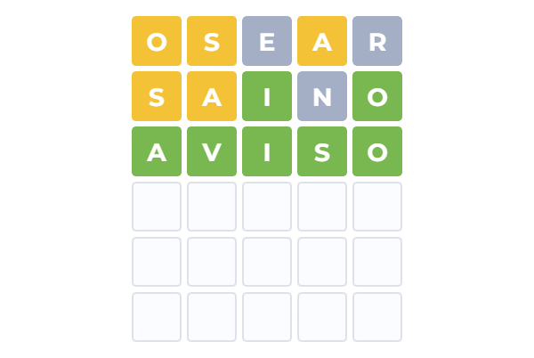
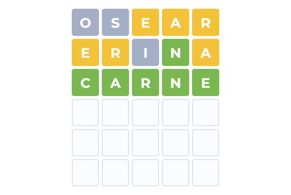
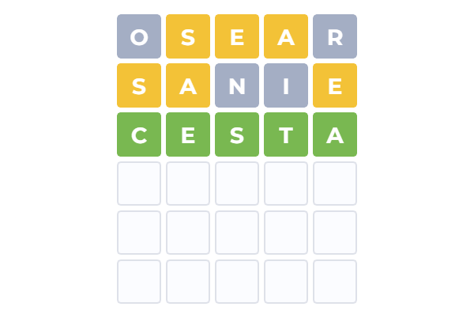
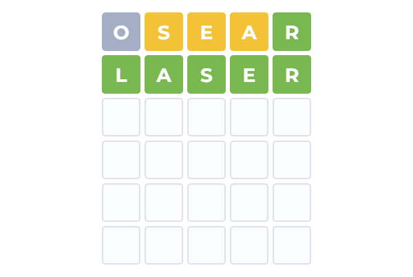
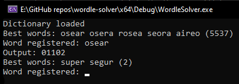

This tool is a wordle helper. It uses a dictionary and letter frequency to determine which are the best words to use. Those are the first four tries I got using this tool:

   
   
   

---

### HOW TO USE
- First of all, open config.txt and change the language to the one you want to (must have a .dic and .lf file inside Languages folder) and set the amount of letters the words will have
- When you run the code, it will prompt you with the best 5 possible answers. Once you have chosen your word into Wordle, you will have to input the word you chose. Then it will ask you for the result. 0 = letter is not in the word; 1 = letter is not in the correct index; 2 = letter is in the correct index. Then it will prompt you again with the new best possible answers

  

---

### HOW TO ADD A NEW LANGUAGE
- Search on the internet a dictionary of the language you want to add and put it in the "Languages" folder. Name it {language}.dic
- Try to find on the internet (wikipedia can help) the letter frequency of that language. Manually create the file (you can take english.lf as reference) and put it in the "Languages" folder. Name it {language}.lf
